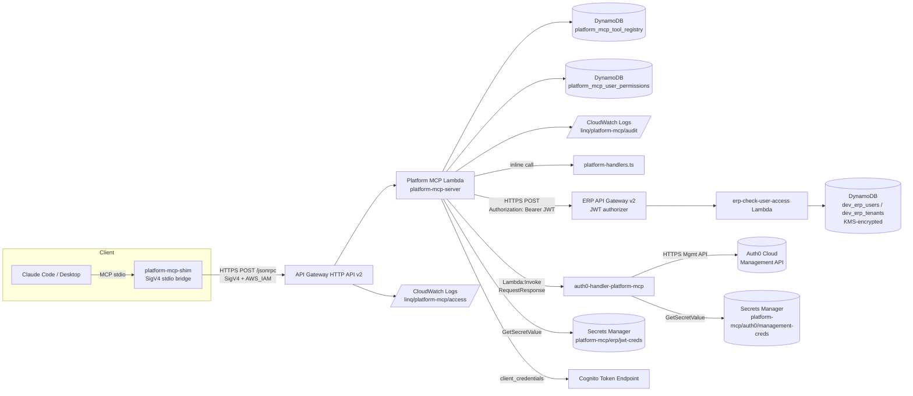
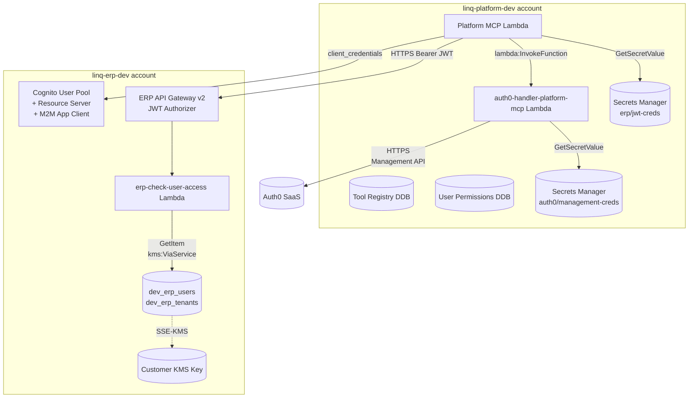
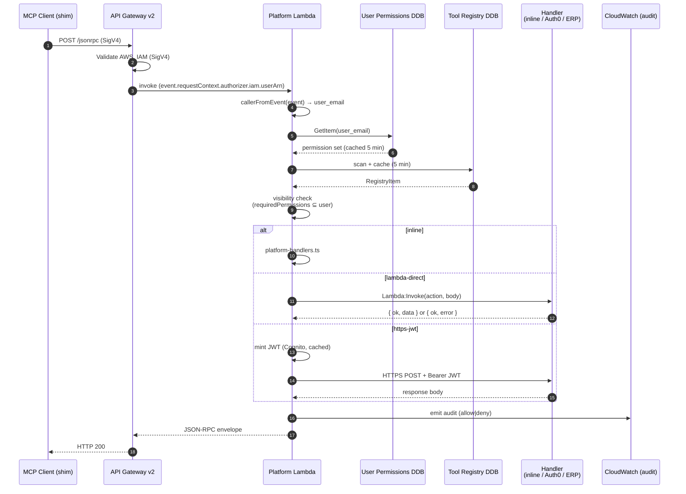

# LINQ Platform MCP Server — Architecture

> Internal hackathon project (V1, May 2026). Read-only tools, internal employees only. Not for production exposure.

This document is the single end-to-end reference for how the LINQ Platform MCP Server works: the components, the request lifecycle, the dispatch model, the security boundaries, the data model, and how it's deployed. It complements (does not duplicate) two narrower references:

- [`docs/dispatch-patterns.md`](dispatch-patterns.md) — the canonical reference for the three dispatch kinds.
- [`docs/aws-sso-permission-set.md`](aws-sso-permission-set.md) — the SSO permission-set definition users must hold.

---

## 1. Introduction

The Platform MCP Server is a single AWS Lambda (Node 20, arm64, behind HTTP API Gateway v2 with `AWS_IAM` auth) that speaks **Model Context Protocol 2025-06-18** as JSON-RPC 2.0 over a single HTTPS POST route. Authenticated LINQ employees — using their AWS SSO credentials, signed via SigV4 — call `tools/list` and `tools/call`. The server enforces a per-user RBAC projection over a **DynamoDB-backed tool registry**, then dispatches each call to one of three backends:

1. **`inline`** — in-process platform meta-tools.
2. **`https-jwt`** — cross-account product handlers, OAuth `client_credentials` JWT over public HTTPS.
3. **`lambda-direct`** — in-account platform-team handlers, synchronous `Lambda:Invoke`.

Every request emits exactly one structured audit record to CloudWatch Logs.

**Repo phases** (from [`CHANGELOG.md`](../CHANGELOG.md)):

| Phase | What landed |
| --- | --- |
| Phase A (2026-05-06) | Repo scaffolding, TypeScript build, AWS SDK v3 deps. |
| Phase 1 | Platform Lambda + DDB tables + ERP `https-jwt` reference handler. |
| Phase 2 | Auth0 management Lambda ported in-account. |
| Phase 3 | Auth0 CFN + platform IAM grant + deploy script. |
| Phase 4 | Seeding scripts for Auth0 secret + tool registry rows. |
| Phase 5 | Dispatch-patterns reference doc + README + CHANGELOG. |

**Explicit non-goals** (per current state of the repo):

- **No multi-tenancy.** The platform has no tenant concept. A user with permission to call a tool can call it for any tenant the tool itself accepts; tenant scope (if any) is enforced at the handler. See the comment at [src/types.ts:14](../src/types.ts).
- **No environment split.** A single `prod` stage parameter on every CFN template; no separate dev/staging/prod infrastructure.
- **No token caching in the Auth0 handler.** A fresh Auth0 M2M token is minted on every invocation — flagged as a hackathon constraint at [infra/auth0-handler/src/index.ts:12](../infra/auth0-handler/src/index.ts).
- **No write tools.** All nine registered tools are read-only by design.

---

## 2. High-level architecture

### 2.1 System context



### 2.2 Cross-account topology



The org-level SCP blocks cross-account `execute-api:Invoke`, so the platform → ERP hop deliberately runs **OAuth Bearer over public HTTPS** instead of any IAM-based wire. The platform → Auth0-handler hop stays in one account, so it uses synchronous `Lambda:Invoke` and never needs a JWT.

### 2.3 Resources by stack

| AWS resource | Stack file | Notes |
| --- | --- | --- |
| Platform Lambda, both DDB tables, HTTP API, audit + access log groups, IAM role | [`infra/cfn/platform.yaml`](../infra/cfn/platform.yaml) | Deploys to `linq-platform-dev`. |
| Auth0 handler Lambda, Auth0 secret, invoke-permission grant | [`infra/auth0-handler/cfn/auth0-handler.yaml`](../infra/auth0-handler/cfn/auth0-handler.yaml) | Deploys to `linq-platform-dev` (same account as platform). |
| ERP Lambda, Cognito User Pool + Domain + Resource Server + App Client, ERP API GW with JWT authorizer | [`infra/erp-handler/cfn/erp-handler.yaml`](../infra/erp-handler/cfn/erp-handler.yaml) | Deploys to `linq-erp-dev`. |

---

## 3. Core concepts

A glossary; each entry points at the canonical code location.

- **MCP (Model Context Protocol) 2025-06-18.** JSON-RPC 2.0 over HTTPS. The server implements `initialize`, `tools/list`, `tools/call`, and accepts JSON-RPC notifications (no `id`) which return HTTP 204. Protocol version is hardcoded at [src/index.ts:28](../src/index.ts).

- **Caller.** A LINQ employee identified by their work email, parsed from the AWS-SSO assumed-role ARN's `role-session-name` segment. See [src/caller-identity.ts:54](../src/caller-identity.ts) (`parseAssumedRoleArn`). The full envelope shape is `Caller` at [src/types.ts:5](../src/types.ts).

- **User permissions.** A set of fine-grained permission strings (e.g. `platform:auth0:logs:read`, `erp:user:read`) loaded per-call from `platform_mcp_user_permissions`. The platform has no tenant concept — same set applies everywhere. Loader: [src/user-permissions-store.ts:99](../src/user-permissions-store.ts).

- **Tool registry.** One DynamoDB row per `toolId` describing how the tool is dispatched, what permissions it requires, and its input/output schemas. Type at [src/types.ts:60](../src/types.ts) (`RegistryItem`). Cached 5 minutes in-process at [src/registry.ts:17](../src/registry.ts).

- **Dispatch target.** The discriminated union that tells the dispatcher how to invoke a tool. Three kinds: `inline`, `https-jwt`, `lambda-direct`. Definition at [src/types.ts:45](../src/types.ts); patterns explained in [`docs/dispatch-patterns.md`](dispatch-patterns.md).

- **Visibility.** A tool is visible to a caller iff `status === "active"` AND every entry in `requiredPermissions` is in the caller's permission set. Same predicate filters `tools/list` and gates `tools/call`. Implemented once at [src/registry.ts:104](../src/registry.ts) (`isVisibleTo`).

- **Audit record.** One JSON line per request to `/linq/platform-mcp/audit` (90-day retention). Shape: `AuditRecord` at [src/types.ts:85](../src/types.ts). Emitter: [src/audit.ts:26](../src/audit.ts) (`emitAudit`) — fail-safe: errors log to stderr, never throw into the request path.

- **Access log.** A separate API Gateway access log at `/linq/platform-mcp/access` (30-day retention) capturing the HTTP-edge view. Format defined at [`infra/cfn/platform.yaml:170`](../infra/cfn/platform.yaml).

- **Wire shape (downstream).** The body the platform sends to either an `https-jwt` or a `lambda-direct` handler is `{ caller_email, request_id, arguments }`. `lambda-direct` adds a top-level `action` from the registry row (not from user input — security property). Defined and explained at [src/lambda-direct-dispatcher.ts:96](../src/lambda-direct-dispatcher.ts).

---

## 4. Request lifecycle

### 4.1 Sequence



### 4.2 Walkthrough (with code anchors)

1. **Edge auth.** API Gateway HTTP API v2 has `DefaultAuthorizer: AWS_IAM` ([`infra/cfn/platform.yaml:166`](../infra/cfn/platform.yaml)). Invalid SigV4 signatures fail at the edge and never reach the Lambda.
2. **Lambda entry.** [src/index.ts:36](../src/index.ts) (`handler`) generates a `request_id`, captures `startedAtMs`, then extracts the caller via [src/caller-identity.ts:84](../src/caller-identity.ts). If no caller can be parsed (route misconfigured without IAM auth), returns `401`.
3. **JSON-RPC envelope parse.** The body is parsed; notifications (no `id` or `notifications/*` method) audit-log and return HTTP 204 ([src/index.ts:66](../src/index.ts)). Invalid envelopes return JSON-RPC `Invalid Request`.
4. **Permissions load.** [src/user-permissions-store.ts:99](../src/user-permissions-store.ts) reads `platform_mcp_user_permissions[user_email]` with a 5-minute, 1024-entry TTL cache. A cache miss for an unprovisioned user is also cached (`null` value) to absorb retries. Failures audit-log with `denial_reason: "PERMISSIONS_LOAD_FAILED"`; missing user audits with `"USER_NOT_PROVISIONED"`.
5. **Method routing.** [src/index.ts:122](../src/index.ts) switches on `rpc.method`:
   - `initialize` returns `{ protocolVersion, capabilities, serverInfo }`.
   - `tools/list` projects the registry by the caller's permissions ([src/registry.ts:81](../src/registry.ts) `getProjected`).
   - `tools/call` runs the dispatch flow at [src/routes/tools-call.ts:34](../src/routes/tools-call.ts) (`handleToolsCall`).
   - Anything else returns `Method Not Found`.
6. **Tool resolution + visibility check.** `handleToolsCall` calls [src/registry.ts:96](../src/registry.ts) (`getById`), then enforces visibility with [src/registry.ts:104](../src/registry.ts) (`isVisibleTo`). Both `not found` and `not visible` deny with the **same** error string `TOOL_NOT_FOUND` so unauthorized callers cannot distinguish "doesn't exist" from "not for you" — comment at [src/routes/tools-call.ts:53](../src/routes/tools-call.ts).
7. **Dispatch.** Routed by `dispatchTarget.kind`:
   - **`inline`** ([src/routes/tools-call.ts:60](../src/routes/tools-call.ts)) — switches on `toolId` to call `whoami`, `listProducts`, or `searchTools` from `platform-handlers.ts`.
   - **`lambda-direct`** ([src/routes/tools-call.ts:132](../src/routes/tools-call.ts)) — calls [src/lambda-direct-dispatcher.ts:190](../src/lambda-direct-dispatcher.ts) which does a synchronous `RequestResponse` `Lambda:Invoke` with a 15-second timeout, mapping `FunctionError` → 502 and timeouts → 504.
   - **`https-jwt`** ([src/routes/tools-call.ts:184](../src/routes/tools-call.ts)) — calls [src/jwt-dispatcher.ts:189](../src/jwt-dispatcher.ts) which loads JWT credentials from Secrets Manager, mints/uses a cached Cognito token (`expires_in - 5min` margin), then HTTPS-POSTs the body with `Authorization: Bearer <jwt>`.
8. **Audit emit.** [src/routes/tools-call.ts:231](../src/routes/tools-call.ts) (`audit`) writes one record to `/linq/platform-mcp/audit` with `decision`, `denial_reason`, `outbound_status`, `latency_ms`, and the upstream error class. Audit emit failures log to stderr but never propagate ([src/audit.ts:26](../src/audit.ts)).
9. **Response.** Successful dispatches return MCP-shape `{ content: [{ type: "text", text }], structuredContent }` wrapped in a JSON-RPC `result`. Errors return JSON-RPC `error` envelopes with platform-defined denial reasons.

---

## 5. Components deep dive

### 5.1 Platform MCP Lambda

| Property | Value |
| --- | --- |
| Function name | `platform-mcp-server` |
| Runtime / arch | Node 20 / arm64 |
| Memory / timeout | 512 MB / 30 s |
| Reserved concurrency | 10 |
| Entry handler | `index.handler` ([src/index.ts:36](../src/index.ts)) |
| HTTP route | `POST /jsonrpc` (single route) |
| Auth | `AWS_IAM` (default authorizer at the API level) |

Definition at [`infra/cfn/platform.yaml:85`](../infra/cfn/platform.yaml). The Lambda role's IAM scope (in addition to `AWSLambdaBasicExecutionRole`):

- `dynamodb:GetItem`, `dynamodb:Scan`, `dynamodb:Query` on the two tables only ([`platform.yaml:99`](../infra/cfn/platform.yaml)).
- `logs:CreateLogStream`, `logs:PutLogEvents` on `/linq/platform-mcp/audit:*`.
- `secretsmanager:GetSecretValue` on `platform-mcp/*` (used only by `https-jwt` cross-account dispatch).
- `lambda:InvokeFunction` on `arn:aws:lambda:${AWS::Region}:${AWS::AccountId}:function:auth0-handler-platform-mcp` (used only by `lambda-direct`).

Named cross-stack outputs include the API URL and the Lambda role ARN ([`platform.yaml:181`](../infra/cfn/platform.yaml)) — the role ARN is consumed by the Auth0 handler stack to grant resource-policy invoke-permission.

### 5.2 Tool registry (DynamoDB)

Table `platform_mcp_tool_registry` at [`infra/cfn/platform.yaml:52`](../infra/cfn/platform.yaml). Hash key `toolId`, on-demand billing, retain-on-delete, PITR + SSE enabled.

Row shape (`RegistryItem` at [src/types.ts:60](../src/types.ts)):

| Field | Type | Notes |
| --- | --- | --- |
| `toolId` | string | Hash key. Also the MCP `name`. |
| `version` | string | Informational, reported by `tools/list` but not currently used for routing. |
| `status` | `"active"` &#124; `"deprecated"` &#124; `"retired"` | Only `active` rows appear in `tools/list` or accept `tools/call`. |
| `description`, `title` | string | Surfaced to MCP clients. |
| `inputSchema`, `outputSchema` | JSON Schema | Surfaced to MCP clients verbatim. |
| `requiredPermissions` | string[] | Set-intersection RBAC; ALL must be in caller's set. |
| `dispatchTarget` | `DispatchTarget` | Discriminated union ([src/types.ts:45](../src/types.ts)). |
| `createdAt`, `updatedAt` | ISO-8601 | Set by seeding script. |

Access pattern: a single in-process cache absorbs hot reads. [src/registry.ts:66](../src/registry.ts) (`getAll`) does a full-table `Scan` and caches for 5 min. `getProjected` (used by `tools/list`) and `getById` (used by `tools/call`) both read through that cache. There is no DDB-side filter — small catalog, simple cache.

Seeded by [`scripts/seed-tool-registry.ts`](../scripts/seed-tool-registry.ts): scans the existing rows, deletes orphans (rows whose toolId is no longer in the desired set), and upserts the desired set with `PutCommand`. Idempotent — safe to re-run.

### 5.3 User permissions (DynamoDB)

Table `platform_mcp_user_permissions` at [`infra/cfn/platform.yaml:31`](../infra/cfn/platform.yaml). Hash key `user_email`, same retention/encryption posture as the registry.

Row shape (`UserPermissions` at [src/types.ts:19](../src/types.ts)):

| Field | Type | Notes |
| --- | --- | --- |
| `user_email` | string | Hash key — matches the SSO role-session-name. |
| `permissions` | `Set<string>` | DynamoDB string set; unmarshalled to a JS Set in code. |
| `last_modified_at` | ISO-8601 | |
| `last_modified_by` | string | Optional audit field. |

Loader at [src/user-permissions-store.ts:40](../src/user-permissions-store.ts) (`ddbPermissionsStore`). The 5-minute TTL cache caps at 1024 entries and prunes by oldest expiry. Both hits AND misses (unprovisioned users) are cached to absorb retry storms.

Seeded by [`scripts/seed-demo-user.ts`](../scripts/seed-demo-user.ts) with the demo permission set (all five Auth0 reads + the ERP read).

### 5.4 Dispatch patterns

A short summary; the canonical reference is [`docs/dispatch-patterns.md`](dispatch-patterns.md).

| Kind | Where the work runs | Wire | Platform IAM grant |
| --- | --- | --- | --- |
| `inline` | In-process | None | None beyond DDB read |
| `https-jwt` | Per-product API GW (cross-account) | OAuth Bearer JWT | `secretsmanager:GetSecretValue` on `platform-mcp/<family>/*` |
| `lambda-direct` | In-account Lambda | AWS-SDK `Lambda:Invoke` | `lambda:InvokeFunction` on the function ARN |

Mapping of the 9 currently-registered tools to dispatch kinds:

| Tool | Kind | Required permission |
| --- | --- | --- |
| `platform_whoami` | `inline` | (visible to all provisioned users) |
| `platform_list_products` | `inline` | (visible to all provisioned users) |
| `platform_search_tools` | `inline` | (visible to all provisioned users) |
| `erp_checkUserAccess` | `https-jwt` | `erp:user:read` |
| `platform_auth0_clients` | `lambda-direct` (action `clients`) | `platform:auth0:clients:read` |
| `platform_auth0_logs` | `lambda-direct` (action `logs`) | `platform:auth0:logs:read` |
| `platform_auth0_sec` | `lambda-direct` (action `sec`) | `platform:auth0:sec:read` |
| `platform_auth0_stats` | `lambda-direct` (action `stats`) | `platform:auth0:stats:read` |
| `platform_auth0_user` | `lambda-direct` (action `user`) | `platform:auth0:user:read` |

Total: 3 inline + 1 https-jwt + 5 lambda-direct = 9.

### 5.5 Auth0 handler (in-account Lambda)

Function name `auth0-handler-platform-mcp` ([`infra/auth0-handler/cfn/auth0-handler.yaml:69`](../infra/auth0-handler/cfn/auth0-handler.yaml)). Same Node 20 / arm64 / 512 MB / 30 s envelope as the platform Lambda, but a much smaller IAM scope: the Lambda role grants `secretsmanager:GetSecretValue` ONLY on `platform-mcp/auth0/*`. No DDB, no KMS, no Lambda-invoke.

**Entry & dispatch.** [`infra/auth0-handler/src/index.ts:39`](../infra/auth0-handler/src/index.ts) accepts the platform's `PlatformInvokeEvent` (`{ caller_email, request_id, action, arguments }`), validates `action` against the allowed set, loads the Auth0 M2M creds, mints a fresh token (no caching — flagged hackathon constraint at line 12), and routes on `action` to one of:

| Action | Tool | What it does |
| --- | --- | --- |
| `clients` | `platform_auth0_clients` | List/get Auth0 application clients. Defensively strips `client_secret`, `signing_keys`, `encryption_key`. |
| `logs` | `platform_auth0_logs` | Lucene query OR checkpoint pagination of `/api/v2/logs`. Caps at 1000 events. |
| `stats` | `platform_auth0_stats` | Window-based metrics: daily, MAU, failures, MFA adoption, top connections. |
| `sec` | `platform_auth0_sec` | Look up an IP/email/user_id/policy/status against anomaly blocks, user blocks, attack-protection policies. |
| `user` | `platform_auth0_user` | Get one user by email or user_id. Defensively strips `password_hash`, `phone_password_hash`, `last_password_reset`, `guardian_authenticators`. |

**Auth0 credentials.** Stored as a JSON blob in Secrets Manager at `platform-mcp/auth0/management-creds`: `{ domain, client_id, client_secret }`. The CFN template creates a placeholder secret; [`scripts/seed-auth0-secret.ts`](../scripts/seed-auth0-secret.ts) overwrites the real credentials post-deploy. The Lambda's loader rejects empty or `"PLACEHOLDER"` values to fail early on unseeded environments.

**Result envelope.** Every handler returns `{ ok: true, data }` on success or `{ ok: false, error: { type, detail, hint } }` on failure. Error types: `bad_action`, `bad_query`, `uri_too_large`, `auth_failed`, `rate_limited`, `api_error`, `missing_env`. Mapping is centralized in `error-envelope.ts`.

**Defensive output filtering.** Even though Auth0 should not return sensitive fields on these endpoints, the handler strips them anyway — preserved as a security property regardless of upstream Auth0 behavior. Comment at [`infra/auth0-handler/src/index.ts:15`](../infra/auth0-handler/src/index.ts).

**Cross-account-safe by design.** This handler stays in `linq-platform-dev` and is reached via `Lambda:Invoke`, NOT JWT. The platform never sees the Auth0 credentials. The Auth0 handler never sees the caller's IAM role. The two-way trust is:

1. Platform role → `lambda:InvokeFunction` on the handler's ARN ([`platform.yaml:134`](../infra/cfn/platform.yaml)).
2. Handler resource policy → `Principal: <platform role ARN>`, `Action: lambda:InvokeFunction` ([`auth0-handler.yaml:98`](../infra/auth0-handler/cfn/auth0-handler.yaml)).

### 5.6 ERP handler (cross-account)

Function name `erp-check-user-access` in `linq-erp-dev` ([`infra/erp-handler/cfn/erp-handler.yaml:128`](../infra/erp-handler/cfn/erp-handler.yaml)). The reference implementation of the `https-jwt` pattern.

**Cognito M2M.** A user pool, a domain, a resource server (identifier `linq-erp-mcp`, scope `erp.invoke`), and an app client with `GenerateSecret: true` and `AllowedOAuthFlows: client_credentials`. Tokens are minted by the platform from `https://<prefix>.auth.<region>.amazoncognito.com/oauth2/token` with HTTP Basic auth (client_id:client_secret) and `grant_type=client_credentials`. Mint code at [src/jwt-dispatcher.ts:67](../src/jwt-dispatcher.ts).

**API Gateway.** HTTP API v2 with a `CognitoJwt` authorizer bound to the user-pool issuer + the app-client audience ([`erp-handler.yaml:118`](../infra/erp-handler/cfn/erp-handler.yaml)). Single route `POST /erp/checkUserAccess`. SCP-safe — no cross-account IAM action involved.

**KMS-encrypted DDB.** The Lambda role grants `dynamodb:GetItem` on the two tables and `kms:Decrypt`/`kms:DescribeKey` on a customer-managed KMS key, conditioned on `kms:ViaService = dynamodb.<region>.amazonaws.com` so the role cannot use the key for anything except DDB reads.

**Cognito creds in the platform.** [`scripts/seed-jwt-secret.ts`](../scripts/seed-jwt-secret.ts) reads the per-stack outputs (`CognitoTokenEndpoint`, `CognitoClientId`, scope) and the app-client secret from `cognito-idp:DescribeUserPoolClient`, then writes them to `platform-mcp/erp/jwt-creds` in the platform account.

### 5.7 Caller identity & SigV4

Two-step extraction at [src/caller-identity.ts:84](../src/caller-identity.ts):

1. **Pull the assumed-role ARN** from `event.requestContext.authorizer.iam.userArn` (HTTP API v2 shape) or `event.requestContext.identity.userArn` (REST API v1 fallback) — [src/caller-identity.ts:30](../src/caller-identity.ts).
2. **Parse the SSO assumed-role ARN.** AWS SSO assumed-role ARNs are shaped `arn:aws:sts::ACCOUNT:assumed-role/AWSReservedSSO_<PERMSET>_<HASH>/<email>`. The trailing session name is the user's email; the role-name middle segment carries the permission-set name. Regex at [src/caller-identity.ts:61](../src/caller-identity.ts).

The permission set users must hold is documented in [`docs/aws-sso-permission-set.md`](aws-sso-permission-set.md). The shim — `scripts/platform-mcp-shim.ts` — handles the actual SigV4 signing on the client side; Claude Code and Claude Desktop launch it as a stdio MCP server.

---

## 6. Security model

The platform is built around **three independent boundaries**, in this order. A request must pass each one to succeed.

### 6.1 Authentication boundary (edge)

API Gateway `AWS_IAM` auth verifies SigV4 against the caller's AWS SSO temporary credentials. Invalid signatures fail at the API edge and never reach the Lambda — no compute, no logs in the audit group, only the access log. Configuration at [`platform.yaml:161`](../infra/cfn/platform.yaml).

### 6.2 Authorization boundary (RBAC)

Once inside the Lambda, [src/registry.ts:104](../src/registry.ts) (`isVisibleTo`) is the single predicate enforced:

```text
visible(item, user) ⇔ item.status == "active" AND item.requiredPermissions ⊆ user.permissions
```

It governs both `tools/list` (the user only sees what they can call) and `tools/call` (a user calling an invisible tool sees the same `TOOL_NOT_FOUND` error as for a non-existent tool — no metadata leak about tools they're not authorized for).

### 6.3 Trust-boundary crossings

| Hop | Mechanism | Why this and not something else |
| --- | --- | --- |
| Client → API GW | SigV4 over AWS_IAM | Only LINQ employees with AWS SSO can call. |
| Platform → Auth0 handler | `Lambda:Invoke` (same account) | Same account; AWS SDK is the cheapest, most direct path. |
| Platform → ERP handler | OAuth Bearer JWT (Cognito) | LINQ org SCP blocks cross-account `execute-api:Invoke`. JWT routes around it. |
| Auth0 handler → Auth0 SaaS | M2M client_credentials, mgmt API | Fresh token per invocation (hackathon — see §1 non-goals). |
| Platform → Cognito (mint) | Public HTTPS, Basic auth client_id:client_secret | Standard OAuth client_credentials pattern. |

### 6.4 Secrets

All secrets live under `platform-mcp/*` in the platform account's Secrets Manager:

| Secret | Owner | Read by |
| --- | --- | --- |
| `platform-mcp/auth0/management-creds` | Auth0 handler stack | Auth0 handler Lambda only |
| `platform-mcp/erp/jwt-creds` (and similar `platform-mcp/<family>/*`) | Platform stack | Platform Lambda only |

Each Lambda's role is scoped to **just** the secrets it owns. The platform Lambda CANNOT read the Auth0 secret; the Auth0 Lambda CANNOT read the JWT secrets. CFN creates placeholder secrets at deploy; post-deploy seeders overwrite values.

### 6.5 Audit + access logs

Two CloudWatch log groups:

| Group | Retention | Source | Format |
| --- | --- | --- | --- |
| `/linq/platform-mcp/audit` | 90 days | Platform Lambda (`emitAudit`) | JSON `AuditRecord` per request — see [src/types.ts:85](../src/types.ts) |
| `/linq/platform-mcp/access` | 30 days | API Gateway access log | JSON: `requestId`, `userArn`, `status`, `integrationStatus`, `latency` |

Audit records use `decision: "allow" | "deny"` and a small set of `denial_reason` codes (`TOOL_NOT_FOUND`, `PERMISSIONS_LOAD_FAILED`, `USER_NOT_PROVISIONED`, `JWT_MINT_FAILED`, `UPSTREAM_<status>`, `DISPATCH_ERROR`, `INLINE_HANDLER_ERROR`, `INLINE_TOOL_UNKNOWN`, `DISPATCH_TARGET_UNKNOWN`, `UNHANDLED_ERROR`). Sites that emit each code are visible by grep in [src/routes/tools-call.ts](../src/routes/tools-call.ts) and [src/index.ts](../src/index.ts).

### 6.6 Defensive output filtering

Even when a downstream API is the trusted authority, the handler strips fields that should never cross the boundary:

- Auth0 `clients` — strip `client_secret`, `signing_keys`, `encryption_key`.
- Auth0 `user` — strip `password_hash`, `phone_password_hash`, `last_password_reset`, `guardian_authenticators`.

Comment at [`infra/auth0-handler/src/index.ts:15`](../infra/auth0-handler/src/index.ts).

### 6.7 Untrusted strings

Auth0 log content (user emails, IPs, descriptions, user-agents) is treated as untrusted data, returned to the platform as-is. Downstream consumers — including the LLM — must escape/render it as data, never interpret it as control flow. Same comment block.

---

## 7. Data model

### 7.1 `platform_mcp_tool_registry` (DynamoDB)

Hash key: `toolId`. See §5.2 for field-by-field schema.

`DispatchTarget` (discriminated union, [src/types.ts:45](../src/types.ts)):

```ts
| { kind: "inline" }
| { kind: "https-jwt"; url: string; tokenSecretArn: string; scope: string }
| { kind: "lambda-direct"; lambdaArn: string; action: string }
```

### 7.2 `platform_mcp_user_permissions` (DynamoDB)

Hash key: `user_email`. See §5.3.

### 7.3 Secrets Manager

| Secret | JSON shape |
| --- | --- |
| `platform-mcp/auth0/management-creds` | `{ "domain": string, "client_id": string, "client_secret": string }` |
| `platform-mcp/erp/jwt-creds` | `{ "client_id": string, "client_secret": string, "token_endpoint": string, "scope"?: string, "audience"?: string }` |

### 7.4 Wire shapes

**`tools/call` request** (JSON-RPC over HTTP):

```json
{
  "jsonrpc": "2.0",
  "id": "<rpc-id>",
  "method": "tools/call",
  "params": { "name": "<toolId>", "arguments": { /* tool inputs */ } }
}
```

**Platform → handler payload** (both `lambda-direct` and `https-jwt`):

```json
{
  "caller_email": "user@linq.com",
  "request_id": "<request-id>",
  "arguments": { /* verbatim tools/call params.arguments */ }
}
```

For `lambda-direct`, the platform additionally injects `action` at the top level (see security comment at [src/lambda-direct-dispatcher.ts:92](../src/lambda-direct-dispatcher.ts) — registry-controlled, not user-controlled):

```json
{
  "caller_email": "user@linq.com",
  "request_id": "<request-id>",
  "action": "user",
  "arguments": { "email": "user@linq.com" }
}
```

**Auth0 handler response envelope** (`HandlerResult`):

```json
{ "ok": true, "data": { /* operation-specific */ } }
{ "ok": false, "error": { "type": "rate_limited", "detail": "...", "hint": "..." } }
```

**Audit record** (`AuditRecord`, [src/types.ts:85](../src/types.ts)):

```json
{
  "request_id": "...",
  "ts": "2026-05-07T17:00:00.000Z",
  "caller_email": "user@linq.com",
  "caller_arn": "arn:aws:sts::...",
  "method": "tools/call",
  "tool_id": "platform_auth0_user",
  "decision": "allow",
  "outbound_status": 200,
  "latency_ms": 312
}
```

---

## 8. Deployment & operations

### 8.1 Three SAM stacks

Deploy in this order; each has its own script under [`scripts/`](../scripts):

1. **Platform** ([`scripts/deploy-platform.sh`](../scripts/deploy-platform.sh)) — `linq-platform-dev`. Creates the two DDB tables, the platform Lambda, the HTTP API, both log groups, the IAM role.
2. **Auth0 handler** (`scripts/deploy-auth0-handler.sh`) — `linq-platform-dev`. Reads the platform role ARN cross-stack export, creates the Auth0 Lambda, the placeholder secret, and the resource-policy invoke permission.
3. **ERP handler** (`scripts/deploy-erp-handler.sh`) — `linq-erp-dev`. Creates the Cognito pool, the ERP API GW with JWT authorizer, and the ERP Lambda.

All three default to `StageName=prod` and `us-east-1`.

### 8.2 Post-deploy seeding

Run in this order — every script is idempotent:

1. **`seed-jwt-secret.ts erp`** — copies Cognito outputs from the ERP stack into `platform-mcp/erp/jwt-creds` in the platform account. Run with `AWS_PROFILE=linq-platform-dev`.
2. **`seed-auth0-secret.ts`** — overwrites `platform-mcp/auth0/management-creds` with real Auth0 M2M credentials (passed via env: `AUTH0_DOMAIN`, `AUTH0_CLIENT_ID`, `AUTH0_CLIENT_SECRET`). Run with `AWS_PROFILE=linq-platform-dev`.
3. **`seed-tool-registry.ts`** — scans `platform_mcp_tool_registry`, deletes orphans, and upserts the 9 tools. Requires `AUTH0_LAMBDA_ARN`, `ERP_API_URL`, `ERP_JWT_SECRET_ARN` from the prior stack outputs.
4. **`seed-demo-user.ts`** — inserts the demo user into `platform_mcp_user_permissions` with all 6 currently-defined permissions.

The full command sequence is in the [README Quickstart](../README.md#quickstart).

### 8.3 Environments and accounts

| AWS profile | Account | What lives there |
| --- | --- | --- |
| `linq-platform-dev` | Platform | Platform Lambda, both DDB tables, Auth0 handler Lambda, all `platform-mcp/*` secrets |
| `linq-erp-dev` | ERP | Cognito user pool, ERP API GW, ERP Lambda, KMS-encrypted ERP DDB tables |

There is no dev/staging/prod split today — both are stuck at `StageName=prod`. The ERP table names are the only hint of an env distinction (`dev_erp_*`), and it's a naming convention, not infrastructure.

### 8.4 Client distribution

Claude Code / Desktop don't natively SigV4-sign API GW requests, so the repo ships [`scripts/platform-mcp-shim.ts`](../scripts/platform-mcp-shim.ts) — a stdio MCP server that bridges stdio MCP frames to the Platform API and SigV4-signs each one. Distribution is via global npm install from GitHub:

```sh
npm install -g github:shannoncarver/platform-mcp-server-hackathon
```

See the [README "Using the Platform MCP Server" section](../README.md#using-the-platform-mcp-server-from-claude-code-or-claude-desktop) for the per-app config.

### 8.5 Operating runbook

- **"User added but can't call tools"** — confirm the row in `platform_mcp_user_permissions` (the Lambda caches misses for 5 min; either wait or redeploy to flush).
- **"New tool not appearing"** — the registry cache also has a 5-min TTL. Same options.
- **`USER_NOT_PROVISIONED`** in audit — the SSO email isn't in `platform_mcp_user_permissions`. Re-run `seed-demo-user.ts` or add the row.
- **`JWT_MINT_FAILED`** — Cognito creds in `platform-mcp/erp/jwt-creds` are missing or rotated. Re-run `seed-jwt-secret.ts erp`.
- **Auth0 handler `missing_env`** — the secret is still the placeholder. Run `seed-auth0-secret.ts`.
- **Audit gaps after upstream errors** — the audit emit is fail-safe; check stderr in the Lambda's CloudWatch logs for `AUDIT_EMIT_FAILED`. The decision was made before the emit so the deny path is correct regardless.

---

## 9. Tech stack

- **Runtime:** Node 20.x, TypeScript 5.4, arm64.
- **MCP:** version `2025-06-18`, JSON-RPC 2.0.
- **AWS SDK v3:** `@aws-sdk/client-dynamodb`, `@aws-sdk/lib-dynamodb`, `@aws-sdk/client-lambda`, `@aws-sdk/client-secrets-manager`, `@aws-sdk/client-cognito-identity-provider`, `@aws-sdk/signature-v4` (in the shim), `@smithy/protocol-http`.
- **HTTP:** Node `node:https` directly for the JWT minter and dispatcher (no extra HTTP lib).
- **IaC:** AWS SAM (CloudFormation transform), `sam build` with `esbuild` per-function.
- **Tests:** Jest 29 + ts-jest, single suite under [`test/`](../test).
- **Build of the stdio shim:** esbuild via the `prepare` npm script.

---

## 10. Implementation history

Reading the doc next to `git log` and the [`CHANGELOG.md`](../CHANGELOG.md):

| Phase | Commit hint | What it added |
| --- | --- | --- |
| Phase A | repo bootstrap | Skeleton, deps, package.json, tsconfig. |
| Phase 1 | platform Lambda + ERP | Platform CFN, JSON-RPC routing, RBAC, registry, ERP `https-jwt` reference handler. |
| Phase 2 | `74fc5b7` | Auth0 management skill ported to in-account Lambda (5 ops, defensive field stripping). |
| Phase 3 | `b274401` | Auth0 handler CFN + platform IAM grant (`lambda:InvokeFunction`) + deploy script. |
| Phase 4 | `ce6346e` | Seeding scripts: Auth0 secret + tool registry rows. |
| Phase 5 | `7bddb2d` | `dispatch-patterns.md` reference + README + CHANGELOG. |

A reviewer reading commits in order can verify §5.4 by looking at how the registry seed grew from 4 tools (3 inline + 1 ERP) to 9 (adding 5 Auth0 entries) between Phase 1 and Phase 4.

---

## Appendix A — file map

Quick lookup for the most-cited files:

| Concern | File |
| --- | --- |
| Lambda entry / JSON-RPC routing | [src/index.ts](../src/index.ts) |
| Caller identity (SigV4 → email) | [src/caller-identity.ts](../src/caller-identity.ts) |
| Permissions store (DDB + cache) | [src/user-permissions-store.ts](../src/user-permissions-store.ts) |
| Tool registry (DDB + cache + RBAC) | [src/registry.ts](../src/registry.ts) |
| `tools/call` dispatch | [src/routes/tools-call.ts](../src/routes/tools-call.ts) |
| `tools/list` projection | [src/routes/tools-list.ts](../src/routes/tools-list.ts) |
| `lambda-direct` dispatcher | [src/lambda-direct-dispatcher.ts](../src/lambda-direct-dispatcher.ts) |
| `https-jwt` dispatcher | [src/jwt-dispatcher.ts](../src/jwt-dispatcher.ts) |
| Inline handlers | [src/platform-handlers.ts](../src/platform-handlers.ts) |
| Audit emitter | [src/audit.ts](../src/audit.ts) |
| Type definitions | [src/types.ts](../src/types.ts) |
| Auth0 handler entry | [infra/auth0-handler/src/index.ts](../infra/auth0-handler/src/index.ts) |
| Auth0 token mint + HTTP | [infra/auth0-handler/src/auth0-client.ts](../infra/auth0-handler/src/auth0-client.ts) |
| Auth0 secret loader | [infra/auth0-handler/src/secret-loader.ts](../infra/auth0-handler/src/secret-loader.ts) |
| Platform CFN | [infra/cfn/platform.yaml](../infra/cfn/platform.yaml) |
| Auth0 handler CFN | [infra/auth0-handler/cfn/auth0-handler.yaml](../infra/auth0-handler/cfn/auth0-handler.yaml) |
| ERP handler CFN | [infra/erp-handler/cfn/erp-handler.yaml](../infra/erp-handler/cfn/erp-handler.yaml) |
| Tool-registry seeder | [scripts/seed-tool-registry.ts](../scripts/seed-tool-registry.ts) |
| Auth0-secret seeder | [scripts/seed-auth0-secret.ts](../scripts/seed-auth0-secret.ts) |
| JWT-secret seeder | [scripts/seed-jwt-secret.ts](../scripts/seed-jwt-secret.ts) |
| Demo-user seeder | [scripts/seed-demo-user.ts](../scripts/seed-demo-user.ts) |
| stdio shim | [scripts/platform-mcp-shim.ts](../scripts/platform-mcp-shim.ts) |

## Appendix B — adding a tool

The decision tree for which dispatch kind to use, and the per-kind checklists, are in [`docs/dispatch-patterns.md`](dispatch-patterns.md). Always start there.
